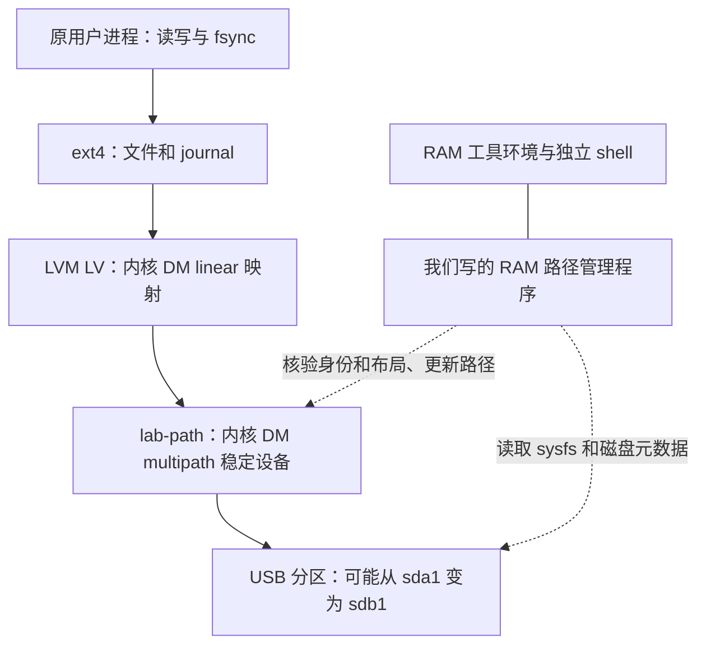

# 部件、实现来源与替换边界

完整 Ubuntu Server 与 Git 克隆集成见 [lab/UBUNTU.md](lab/UBUNTU.md)。

本文对应当前仓库的两条路线：`ram-rescue-demo/` 是本机使用的手动 RAM 救援方案；`lab/` 中的自动恢复是仅在虚拟机中验证的实验方案。源码更新不等于更新已安装包。

这里的“我们实现”指本仓库新增的程序、策略和集成；“上游实现”指 Linux、LVM2、BusyBox、systemd、QEMU 等现有开源项目。两者并不矛盾：一个部件可以由我们编排，实际机制由上游提供。

## 现有功能具体怎么做到

技术栈以 **Python 3.12、POSIX Shell、systemd、Linux Device Mapper/LVM2/ext4、QEMU/KVM** 为主。没有 Web 服务框架或数据库依赖，也没有 eBPF 程序、自编内核模块。JSON 用于登记、控制消息和实验记录；Python unittest 用于恢复逻辑回归。

按一次故障的时间顺序看：

1. **故障前准备工具。** `build.py` 收集 BusyBox、Python、LVM 等二进制及依赖，生成工具包。`prepare.sh` 将包展开到 `tmpfs,noswap`，接入 `/dev`、`/proc`、`/sys` 和共享 LVM 锁目录。systemd 提前启动终端与日志。这样救援命令不必临时从故障根盘加载；RAM 环境仍共用原内核，chroot 只是改变进程看到的根目录。
2. **自动实验额外准备稳定设备。** 在激活 LV、挂载根目录之前，建立 `lab-path` DM multipath 设备，让 LVM 使用它承载 PV。实际请求由内核从 LV 转发到 lab-path，再转发到 USB 分区；每次读写不经过 Python。
3. **USB 路径失效。** 驱动将路径故障报告给上层，dm-multipath 对适用请求执行无路径排队。应用可能阻塞在读写/fsync 上，但不必立刻收到 EIO。排队不是把写入提前当作成功，也不是对任何类型错误都有效。
4. **后台找回原盘。** `path_guard.py` 由内核块设备/DM 事件唤醒并每秒复核 sysfs 和 DM 状态，调用 `Recovery.verify()` 检查 USB 身份、容量、分区 UUID、PV/VG；随后比较 LV 段布局。它可以接受从 sda1 变成 sdb1 的原盘，但拒绝只是盘符或序列号碰巧相同的另一块盘。
5. **切换后端并继续 I/O。** 持有候选设备描述符、再次核验后，通过 `dmsetup load → suspend --noflush --nolockfs → resume` 替换稳定设备的后端。暂停发生在故障之后，用于表切换，并非预知拔盘。上层 LV 和挂载保持，内核继续处理请求；尚存活的原进程继续执行，不涉及进程重建。
6. **失败分支。** 找不到正确盘或超过等待窗口时，管理程序改为 `fail_if_no_path` 并进入终止状态；内核另有无路径超时作为补充退路。错误可能继续传播到文件系统和应用，此后保留 RAM 救援，而不宣称完整恢复。

已安装的手动版只具备第 1 步的环境和人工核验/刷新流程，不具备第 2 步预置的排队层。它调用 `lvchange --refresh` 修正旧 LV 依赖，不能补救此前已经返回的 EIO。自动版的核心工作就是在错误扩散之前，预先把可等待、可切换的内核设备放到请求路径中。

## 1. 整体结构

自动实验中的数据路径如下。箭头表示 I/O 请求向下流动；PV 是 LVM 识别和组织存储的概念，不是额外转发请求的守护进程。

`lab-path` 作为 PV 的承载设备，在 LV 激活和挂载根目录之前创建。断联时内核排队，重连后后台核验并切换它的后端，上层 LV 保持不变。这不是每次 I/O 都经过 Python。

旧手动方案没有这个预置层：LV 直接依赖原 USB 分区，断联后可能先出现 EIO，再由人工调用 `rescue refresh` 更新 LV 映射。映射恢复不能撤销已发生的文件系统或应用错误。

## 2. 各部件由谁完成了什么

| 部件 | 职责 | 上游已有实现 | 本仓库新增工作与位置 |
|---|---|---|---|
| USB / SCSI 驱动 | 枚举设备、提交请求、报告路径故障 | Linux xHCI、UAS、usb-storage、SCSI 块设备驱动 | 选择 guest 模块、制造协议对照；未修改驱动 |
| Device Mapper 核心 | 提供稳定虚拟块设备、映射表及切换机制 | Linux DM；LVM2 的 dmsetup / libdevmapper | 编排建表、核验、加载和切换；没有自写块设备框架 |
| I/O 排队层 | 路径失效时暂存适用的请求，恢复后重试或超时报错 | Linux dm-multipath，BIO 模式、queue_if_no_path、内核无路径超时 | 选定单路径布局、配置等待策略、验证 USB 分区后端；`lab/guest/path_guard.py` 与 `agent.py` |
| 路径管理程序 | 发现失效、寻找重连盘、决定是否接回、超时终止 | 调用 sysfs、libdevmapper、blkid、LVM 和 dmsetup | 我们编写的 `Guard` 状态机、二次核验、布局比较、事件记录、路径切换；`lab/guest/path_guard.py` |
| 设备身份核验 | 避免只因新盘符或序列号相同就接入 | Linux sysfs、util-linux blkid、LVM 元数据解析工具 | 登记字段、唯一候选要求、USB/容量/分区/PV/VG 比较和拒绝策略；`ram-rescue-demo/src/rescue.py` |
| LVM 卷管理 | PV/VG/LV 管理、LV 到物理范围的映射 | LVM2 用户态工具、Linux DM linear | 手动恢复的限制、确认流程、再次核验及结果检查；`Recovery.refresh()`；修正真实 lvs JSON 的 seg 键解析 |
| 文件系统 | 文件、目录、journal、fsync、错误处理 | Linux ext4/JBD2；e2fsprogs 提供 mkfs/e2fsck | 检查可读、可写和 journal 状态；未修改 ext4，也未实现或自动运行修复算法 |
| RAM 救援工具环境 | 根盘断联时仍能启动工具和诊断 | Linux tmpfs、chroot、挂载、cgroup；现成二进制与库 | 依赖打包、noswap、挂载安排、RAM 锁目录共用、资源限制与就绪检查；`ram-rescue-demo/build.py`、`src/prepare.sh`、`src/check.py` |
| 登录与终端 | F9/F10 文本入口和密码认证 | Linux VT、BusyBox login/sh、systemd | 独立 rescue 账号/密码配置、双终端、会话循环和服务配置；`install.py`、`src/supervisor.sh`、`src/session.sh`、`src/*.service` |
| 日志 | 保存故障前后内核消息和 helper 操作 | 内核消息接口、Python 运行时 | RAM 日志采集/轮转、操作记录；`src/kernel_log.py`、`src/rescue.py`；实验另有串口及 QMP 日志 |
| 安装与构建 | 生成运行包、服务与 guest 镜像 | Python、cpio/gzip、Ubuntu 已安装工具 | 我们的构建/安装/卸载/检查脚本；宿主包和实验镜像采用不同入口 |
| 故障实验室 | 模拟 USB 拔插、运行真实 guest 内核 | QEMU 设备模拟、KVM 加速、QMP 控制协议 | 最小 USB 根盘 guest、磁盘初始化、故障时序、错误盘/晚归/后台死亡场景、证据采集；`lab/build.py`、`run.py`、`auto_run.py`、`guest/` |
| 应用验收 | 判断进程和读写是否真的继续 | Python、Linux 文件 I/O 与 fsync 接口 | 同一 PID/启动时间、成功失败计数、延迟、直接块读取、文件前缀回读等检查；`guest/workload.py`、`agent.py` 与 runner |

LVM 是管理和构造卷映射的工具；运行中的每次块 I/O 由内核 DM 完成。`dmsetup` 是控制工具；`dm-multipath` 是内核实现；`multipathd` 则是另一个现成的用户态路径管理守护进程。**当前实验没有运行 multipathd，而由我们的 Guard 管理 dm-multipath。** [上游 multipath-tools](https://github.com/opensvc/multipath-tools)明确区分这些用户态工具；排队机制可查 [Linux 6.8 dm-mpath.c](https://github.com/torvalds/linux/blob/v6.8/drivers/md/dm-mpath.c)。

## 3. 我们实际完成的工作

1. **保住救援入口。** 把必要程序、动态库、认证和日志放到 RAM 中，组织独立终端、启动服务和资源限制。tmpfs、登录认证、shell 和调度机制来自上游。
2. **把恢复操作约束到登记设备。** 实现身份链检查、重复候选拒绝、人工确认后的再次核验，限定已激活的登记线性 LV；实测发现并修正 LVM 段报告解析错误。
3. **将现成排队机制用于单 USB 根盘。** 在 PV 下预先建立稳定 DM 设备，编写路径恢复状态机和超时策略，避免依赖故障后的人工刷新。内核如何保存、重试请求仍由 dm-multipath 实现。
4. **建立可复现的证据链。** 在实际从 USB/LVM/ext4 启动的最小 guest 上做故障注入，对比未保护、预暂停和突发断联自动恢复；检查失败分支而不只检查成功分支。

这是针对特定故障的系统集成、恢复策略和验证工作。目前没有自研 USB 驱动、文件系统、内核排队算法、虚拟机或密码算法；也没有自动复活已经退出的进程。仍存活的进程在 I/O 恢复后继续执行，才是现有成功样本的含义。

## 4. 哪些能替换

以下是工程替换判断，不代表替代方案已经通过本项目验证。

| 替换目标 | 可选方向 | 必须保留的约束 | 工作量判断 |
|---|---|---|---|
| Python Guard / Recovery | 用 Rust/C/Go 重写，或先把策略和设备访问接口拆开 | RAM 中可运行；唯一身份、布局检查、再次核验、有限等待、失败终态、可审计事件 | 最适合先做；可保持数据路径不变 |
| 当前自写路径管理 | 评估 multipathd，或基于它补充登记核验与策略 | 验证单 USB/分区后端、设备身份、根盘启动、RAM 依赖及超时语义；不能让两个管理者同时修改同一张表 | 中等到高；不是安装软件就能等价替换 |
| 路径切换时 subprocess 调 dmsetup（健康查询已用 libdevmapper） | 将剩余变更操作也迁移到 libdevmapper | 保持同样的加载、暂停、恢复、失败处理和观测顺序 | 中等；减少文本命令接口，不会自动改变内核排队能力 |
| 已实现内核事件加每秒复核 | 可进一步收窄事件过滤范围 | 事件只负责唤醒；接盘前仍完整核验；不要让救援依赖故障根盘上的普通服务 | 中等；改变控制响应，不替代内核 I/O 排队 |
| BusyBox 登录和 shell | 其他登录工具、shell、文本 UI；以后增加状态提示 | 工具及依赖提前在 RAM；认证可用；保留独立终端 | 较低到中等；弹窗不应成为恢复必经步骤 |
| systemd 与打包方式 | 其他 supervisor、initramfs 集成、不同镜像制作方案 | 控制程序在故障前就绪；所需依赖不再读故障盘；稳定映射在根 LV 挂载前建立 | 救援服务替换中等；真实根启动集成更高且尚未完成 |
| 日志和通知 | RAM 环形缓冲、独立盘、远程接收端 | 写日志失败不阻塞恢复；接收路径不依赖同一故障盘 | 较低到中等；当前没有远程日志或通知服务 |
| 测试工作负载 | 已加入 Ubuntu/systemd 与 Git；可继续扩展数据库和其他真实程序 | 分别测进程存活、I/O 结果、数据一致性和应用超时 | 优先扩展；现有 fsync/Git 两类负载不能代表全部用户态 |
| QEMU/KVM 实验平台 | 更换虚拟机平台，后续接入可控物理 USB 故障设备 | 能证明真正发生断联/重枚举，并保留独立观测通道和可重现实验 | 可替换，但要重做故障注入与证据采集；QEMU 单独使用 TCG 也可运行，较慢 |
| LVM 或 ext4 | 无 LVM 的文件系统直接放稳定 DM 上；其他文件系统作为实验组 | 重新定义身份与布局登记；重新验证 flush/fsync、错误行为、恢复验收 | 高；现有核验和测试明确绑定 LVM/ext4，不能直接套用 |
| dm-multipath 内核排队层 | 自研 DM target 或其他稳定块设备后端 | 请求完成语义、重试、顺序、flush/FUA、资源上限、路径身份、超时、崩溃一致性 | 最高；这是重新承担数据路径正确性，不只是重写 Guard |

对于本项目，eBPF 更适合作为后续观测手段，例如定位延迟和错误传播；当前没有使用它。它不是把已有 EIO 改掉就能自动获得正确重试语义的替换件。若研究自有拦截机制，应先明确块层接口与请求生命周期，再定义可验证的语义。

## 5. 替换时固定什么

建议先把以下接口从实验代码中抽离，再逐项换实现；这些是建议的边界，当前并非已发布的插件 API。

- **身份模块：** 候选设备 → 核验结果/拒绝原因；不能只返回一个易变盘符。
- **策略模块：** 路径状态、时间、核验结果 → 等待/切换/终止决策。
- **块层控制模块：** 对已核验设备执行路径切换并报告结果；保持上层设备身份。
- **观测模块：** 记录状态、耗时、拒绝原因和结果，不决定设备是否可接入。
- **实验模块：** 独立制造故障、观测同一进程和数据，避免恢复程序用自己的“成功”日志替代验收。

替换 Guard 时可以继续用现有六类自动实验作为对照。替换内核数据路径或文件系统时，需要扩充乱序、部分写入、flush、反复失效、资源压力和断电一致性测试，不能只要求“最后读得到文件”。当前验收记录与限制见 [AUTOMATIC.md](lab/AUTOMATIC.md)。

优先顺序建议：先把用户态身份/策略/控制接口模块化，再扩展完整系统和应用测试；在现成内核机制无法满足明确需求时，再考虑自研数据路径。真实根盘部署仍是独立工作，需要启动集成和可回退方案。

## 6. 上游来源与未使用方案

- [Linux 6.8 dm-multipath 源码](https://github.com/torvalds/linux/blob/v6.8/drivers/md/dm-mpath.c)：本实验实际复用的排队机制；采用 Ubuntu 提供的内核和模块，未修改源码。
- [multipath-tools](https://github.com/opensvc/multipath-tools)：可评估的用户态管理替代方向；当前没有使用其中的 multipathd。
- [QEMU USB emulation](https://www.qemu.org/docs/master/system/devices/usb.html)：提供 USB 设备模拟和热插拔基础；实验场景、guest 构造和验收由本仓库完成。
- BusyBox、systemd、LVM2、util-linux、e2fsprogs、Python 及其运行库：当前从 Ubuntu 环境复制或调用；不属于本仓库重新实现。
- SystemRescue、zramroot 在旧说明中作为相关方案列举；当前没有把它们集成进运行包。systemd debug-shell 是相关机制参考，本仓库运行的是自己的服务文件。

此表是实现来源说明，不是完整依赖清单或许可证清单。公开仓库只提交源码、测试和文档，生成的 guest 镜像与运行包不随 Git 上传。
