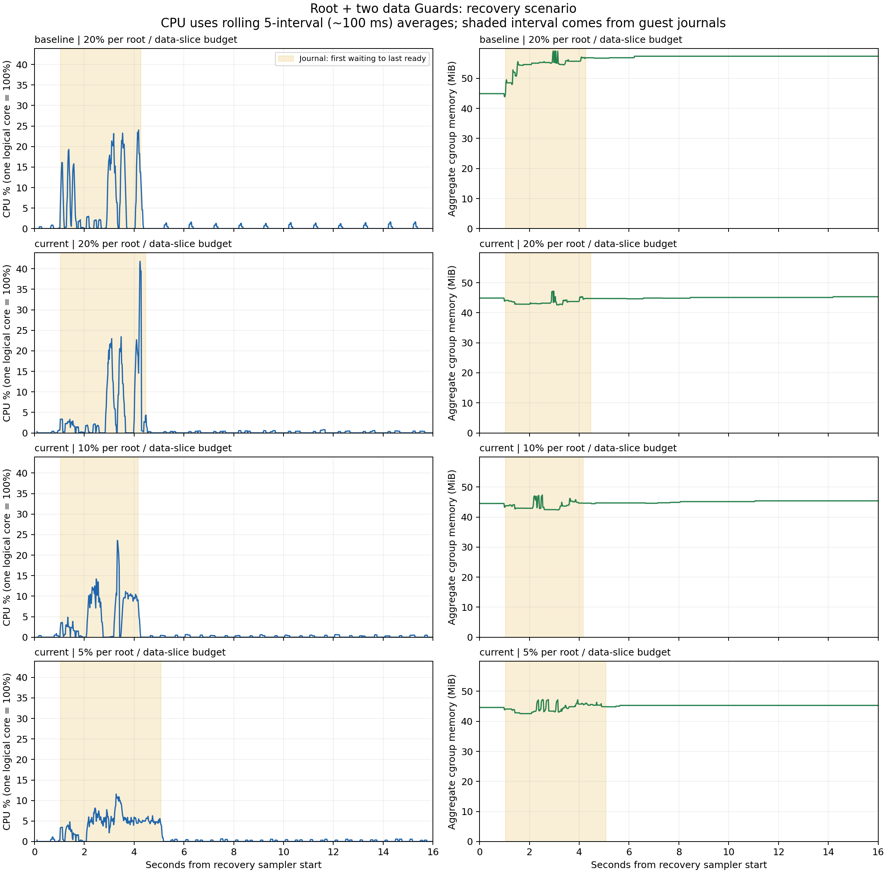

# QEMU 迭代验收：统一维护、挂载连续性与资源开销

本轮继续以本机使用的 Ubuntu Linux `7.0.0-34-generic` 为基线。所有拔插、错误身份、超时、只读挂载和配额实验均使用新建的虚拟磁盘或只读基础镜像上的新 overlay；实机的启动入口、内核、挂载和运行中 Guard 没有在本轮替换。

最终实现保留同一套恢复事务，补齐挂载/子挂载消费者和跨架构接口验证。三个控制器健康空闲约 **0.16% 单核**；无关/相关事件密集场景的 CPU 均值中位数分别降低约 **62% / 37%**。十轮恢复后的 PSS 从 **50.290 MiB 降到 38.562 MiB**。健康期峰值降低，但恢复期仍有短窗口计账尖峰，已保存并独立调查，不承诺硬实时上限。

## 实现与职责

| 部件 | 本轮结果 | 常驻成本与边界 |
|---|---|---|
| 统一维护入口 | 沿用统一入口，并对根盘和两块登记的数据映射共同验收；共用恢复控制器和准入事务 | 保持每个映射一个 owner；管理器准备完成后没有常驻进程 |
| DM / Linux | 继续承担稳定块设备、无路径排队和换表后的内核路径探测 | 没有新增内核补丁或旧内核兼容分支 |
| Python Guard | 健康期筛选登记路径事件、同次检查只解析一次 sysfs；错误记录只保留有界文件/函数/行号 | 恢复期接收全部 block 事件；每秒兜底、最终身份校验和事务 fence 保留；不为格式化异常读取/缓存源码 |
| systemd 挂载 | 新增原生 `.mount` / `.automount` 计划生成器，支持嵌套文件系统和 bind 子挂载 | 不增加轮询进程；按稳定 DM UUID 建立依赖 |
| ABI 层 | ioctl 编码和 libdevmapper 结构统一放入 `linux_abi.py` | 启动时核对 Linux、64 位、小端与 LP64；循环内没有架构判断 |
| C++ 原型 | 可选只读健康观察器，以及同条件 Python 对照 | 尚未替代完整恢复控制器，不随生产服务安装 |

事件筛选发生在用户空间：无关事件仍会进入 netlink socket，减少的是后续 DM / sysfs 查询。筛选只决定是否提前检查，不用事件本身批准设备或判定故障。重枚举到其他 USB 端口仍会由恢复期事件或每秒兜底发现。

原来的重复 ioctl 常量和 `DMInfo` 定义已移入共享 ABI 模块。根盘、数据盘没有各自复制一套恢复状态机；普通文件系统与 LVM 的身份核验保留各自必要的数据规则。挂载层不再次扫描或核验 USB 身份。

## 挂载与进程存活

完整 Ubuntu VM 的挂载验收 **28/28 通过**。根盘与两块数据盘均恢复，5 个挂载对象的 ID、选项保留；主路径和 bind 子路径的原进程、原文件描述符继续工作，持久数据一致。错误身份未被提交；受控只读挂载重连后仍为只读；超时终态不能通过发起新挂载清除。正常卸载后，ext4 和 FAT 的离线只读检查均返回 0。

挂载仍在时，恢复同一个 DM 设备即可继续使用原文件描述符。已经卸载后再挂载，只能重新建立访问路径，不能重建旧文件描述符。生成器因此不主动反复卸载/挂载、不强制或 lazy 卸载，也不执行在线 fsck 或擅自改回读写。

实际原生依赖的行为以 VM 验证为准：Guard 进入终态不保证现存忙碌挂载消失，但在正常卸载后，终态阻止新的挂载启动。根盘额外 LV 的消费者增加保护启动断言，避免 systemd 的条件跳过被误当成保护服务成功。

详细计划、复现命令和证据见 [挂载报告](MOUNT-RECOVERY.md) 与 [使用说明](../../guard/MOUNTS.md)。

## 指令集兼容

| 验收层次 | x86-64 | ARM64 | RISC-V64 |
|---|---|---|---|
| Linux 7 C 头文件与 Python ABI 对照 | 通过 | 通过 | 通过 |
| 每架构 87 项真实 Python 策略测试 | 通过 | QEMU user-mode 通过 | QEMU user-mode 通过 |
| C++ 观察器解析器 | 原生通过 | QEMU user-mode 通过 | QEMU user-mode 通过 |
| 真实内核 USB / DM 恢复 | 完整 Ubuntu VM | Ubuntu 同版本内核、RAM 最小用户空间，11/11 通过 | 尚未验证 |
| 完整保护启动安装器 / 桌面 | 既有本机验证 | 尚未验证 | 尚未验证 |

最终 ARM64 实验中，`sda1` 重枚举为 `sdb1`，原控制器、工作负载、文件描述符和挂载保留；25 次 4 KiB 持久写入及 O_DIRECT 回读均成功，正常卸载和离线 fsck 通过。QMP 间隙约 0.252 秒，最长 I/O 等待 5.155 秒；TCG 的耗时不用于预测实机性能。早期同样通过的版本和原始记录继续保留。

通用恢复 runtime 已验证到上述层次，早期构建器仍有本机登记和 x86 工具路径约束。没有把用户态交叉执行等同于完整异构系统安装支持。工具来源、签名/哈希与复现步骤见 [架构报告](ARCHITECTURE-VALIDATION.md)。

## C++ 可选实验

相同 DM 映射、相同健康条件和频率下，各重复三次：C++ 观察器稳态 CPU 均值约 0.0163%–0.0203%，PSS 约 1.68–1.76 MiB；Python 对照约 0.0392%–0.0478%，PSS 约 9.77–10.23 MiB。CPU 均以一个逻辑核占满为 100%。

这是观察器对观察器的结果。完整身份准入、唯一 owner、换表、超时和死亡接管仍由 Python Guard 完成，不能把观察器的数值当成整个救援系统的占用。C++ 原型也通过了真实错误 UUID / diskseq 拒绝和 USB 断联检测实验。

该实验还观察到：sysfs 中原实例已经消失时，DM 暂时仍可报告路径 `A`。因此保留实例存在性、diskseq 和 DM 状态的组合检查有实际证据支持。详情见 [C++ 报告](NATIVE-OBSERVER.md)。

## 资源测量口径

性能对照统一使用完整 Ubuntu、2 vCPU、3 GiB 内存，根盘加两块数据盘，三个实际 Guard 控制器同时运行。基线把受测改动对应的 `dm_monitor.py` / `path_guard.py` / `owned_operation.py` 取自 `779869c`；第一阶段尚未修改第三个文件，因此当时只需覆盖前两个，其有效恢复实现相同。其余环境一致。实际 RAM 中根盘、数据盘的代码哈希在开始和结束都与选定 payload 核对。

每次预热 3 秒，随后分别采集健康空闲、无关 block 事件约 100 次/秒、根 DM 事件约 100 次/秒各 20 秒，以及三盘同时断联的 16 秒场景窗口。后者另按客户机日志中最早 `waiting` 至最晚 `ready` 提取实际恢复区间，保留其相邻采样边界。

CPU 使用 cgroup 累计计数差值，包含控制器和其子进程。合计只加根服务与数据父 slice，避免将父 slice 和两个子服务重复计算。采样器、工作负载、udev 及其他 cgroup 的内核 worker 不在此统计内。但当前测试内核的记账可能将进程被中断时的 IRQ 时间归给该进程，不能把 cgroup 计费时间全部解释为 Guard 指令执行时间；独立调度诊断见下文。20 ms 和约 100 ms 的峰值都是观察窗口平均，不能理解为任意瞬间的硬上限。

`memory.current` 持续采样；RSS/PSS 只在阶段边界读取。cgroup 生命周期 `memory.peak` 单列，不当成本阶段峰值。PSS、RSS、cgroup 内存、共享救援 tmpfs 互有重叠，不相加；本轮不把控制器 cgroup 当成整个保护系统的全部内存成本。

## 最终版本的性能结果

完整结果见 [最终标准方法数据](../../lab/results/2026-10-01-performance.json)。下表基线和最终版各重复三次，均为三个 Guard 合计、20% 根服务配额加 20% 数据总 slice 配额。均值列给出三次的中位数及范围；峰值列取三次中最高值。内存优化和事件筛选都已包含在最终版本中。

| 场景 | 基线 CPU 均值 % | 最终 CPU 均值 % | 基线 / 最终最坏 20 ms 峰值 % | 基线 / 最终最坏约 100 ms 峰值 % |
|---|---:|---:|---:|---:|
| 健康空闲 | 0.167（0.159–0.174） | 0.159（0.141–0.163） | 7.334 / 4.449 | 1.552 / 0.890 |
| 无关事件约 100 次/秒 | 1.451（1.415–1.473） | 0.555（0.552–0.578） | 16.296 / 7.521 | 3.235 / 1.745 |
| 根 DM 事件约 100 次/秒 | 1.371（1.355–1.447） | 0.862（0.861–0.871） | 14.236 / 7.521 | 2.842 / 2.241 |
| 固定 16 秒恢复场景，含故障前后健康时间 | 1.372（1.338–1.424） | 1.159（1.147–1.342） | 47.094 / **123.103** | 25.080 / **41.820** |

健康空闲范围重叠，不据此宣称稳定降低 25%：较早的事件筛选阶段虽测到 0.125%，最终版重复测量的中位数是 0.159%。强度更高的事件场景呈现较明确的 CPU 降低。最终版恢复阶段的极短峰值并未全面改善；最坏 20 ms 和最坏 100 ms 来自不同运行，均完整保留。

按日志限定的真正恢复区间，基线 → 最终版的 CPU 总计中位数为 **197.089 → 169.332 ms**，窗口平均 **6.469% → 5.222% 单核**。最早 waiting 到全部 ready 的时间中位数为 **3.231 → 3.330 秒**；计费 CPU 减少不等于恢复更快。对应 CPU 采样边界略宽，分别约 3.260 / 3.379 秒。

| cgroup 内存，三个实例合计 | 基线采样均值中位数 MiB | 最终采样均值中位数 MiB | 基线 / 最终最高采样值 MiB |
|---|---:|---:|---:|
| 健康空闲 | 44.677 | 44.472 | 44.969 / 44.766 |
| 固定 16 秒恢复场景 | 55.842 | 44.805 | 59.148 / 47.465 |
| 日志限定的实际恢复窗口 | 54.490 | 43.747 | 59.148 / 47.465 |

恢复后进程 PSS 边界快照为 38.36–38.40 MiB；PSS 不是这张表中的 cgroup 内存，也不能与它相加。上表包含相应 cgroup 的后代，但不等于预装 RAM 工具、原应用及全系统排队脏页的全部成本。

### 最终代码的配额对照

| 根服务 / 数据总 slice 各自配额 | 三盘恢复日志时间秒 | 恢复 CPU 总计 ms | 最坏 20 ms / 约 100 ms 窗口 % | 样本数 |
|---|---:|---:|---:|---:|
| 20% | 3.330 | 169.332 | 123.103 / 41.820 | 3，时间与总量为中位数 |
| 10% | 3.118 | 173.552 | 60.348 / 23.589 | 1 |
| 5% | 4.032 | 187.614 | 25.117 / 11.578 | 1 |

五场最终版本实验的每场 23 项验收均通过。10% 和 5% 的最坏受测工作负载等待分别为约 2.931 / 3.741 秒。配额较低时观察峰值下降，但单场 10% 恢复略快于 20% 中位数也显示了时序波动；不从这些样本推导精确的单调延迟规律或任意平台的峰值保证。

**本轮保留生产默认配额**，并把低配额作为已验证的 VM 选项。用户关注的健康期开销已经通过减少无效检查降低；没有为了单次恢复峰值而同时改变实机调度预算和恢复时限。



图选择基线、最终 20%、10%、5% 各一场，统一坐标；阴影为日志恢复区间。20% 行选择最坏约 100 ms 的那场，另一场的 123.103% 短窗口峰值在表格与 JSON 中保留，未因作图选择而删除。

## 分阶段验证与结果保留

先只优化健康期事件筛选，基线与该版各运行三台独立 VM，并测试 10% 和 5% 配额；这一阶段的八场验收全部通过。原始数值、版本摘要及恢复曲线保存在 [事件筛选阶段数据](../../lab/results/2026-10-01-event-filter-performance.json) 中，后续代码变化不会覆盖这些记录。

| 健康场景，三个 Guard 合计 | 基线 CPU 均值中位数 | 事件筛选版中位数 | 基线最坏约 100 ms 峰值 | 事件筛选版最坏约 100 ms 峰值 |
|---|---:|---:|---:|---:|
| 空闲 | 0.16694% | 0.12544% | 1.55212% | 1.36455% |
| 无关 block 事件约 100 次/秒 | 1.45079% | 0.53140% | 3.23458% | 2.74425% |
| 根 DM 事件约 100 次/秒 | 1.37085% | 0.85274% | 2.84175% | 2.00548% |

这三项中位数分别下降约 25%、63%、38%。该改动降低了健康监视开销，但没有明显减少内存，也没有减少实际恢复所需的 CPU 总量：基线实际恢复 CPU 时间中位数 197.089 ms，事件筛选版 207.365 ms。

事件筛选版的一次恢复出现 **约 21.8 ms 窗口计入 34.57 ms CPU、约 158.45% 单核** 的异常尖峰；最坏约 100 ms 窗口为 48.55%。报告保留原计数、窗口起止和源文件摘要，没有用平均值或删除异常点来掩盖它。配额是周期预算，不能直接承诺任意观察窗口的瞬时上限；具体异常的独立诊断结果将在最终验收中说明。

该阶段 10% / 5% 配额实验均通过 23 项验收，三个控制器完成恢复分别耗时约 3.407 / 4.049 秒（20% 的中位数约 3.222 秒）。约 100 ms CPU 峰值分别为 13.10% / 11.47%；20 ms 窗口为 25.05% / 21.26%。这说明较低配额在这些样本中减少了恢复峰值，但增加节流和恢复等待；它不是对所有驱动故障的上限保证。根服务与数据总 slice 各有一份配额，不能把二者合计误写成只有一份。

## 连续恢复与进一步内存优化

首轮十次共同断联保持原进程、原挂载与持久数据一致，19/19 检查通过。三实例 PSS 从 37.921 MiB 增到首次恢复后的 50.149 MiB，第十次为 50.290 MiB；后五轮 RSS 和匿名内存计数持平。每个控制器的 FD 一直为 7、恢复完成后线程为 1，没有观察到每轮累积的明显泄漏。

日志保留了 12 条消失的底层 sdX 设备 I/O error；受测上层应用没有收到 I/O 错误，确认写入内容一致，离线文件系统检查通过。不能把“上层工作负载存活”改写成“下层从不报错”。

针对首次恢复增加的匿名内存，进一步检查发现错误格式化会延迟导入 traceback、linecache、tokenize、textwrap 和 ast，并读取/缓存源码。现已改为有界的文件名、函数名和行号记录，保持错误类型、消息与事务清理语义。错误记录最多保留 16 个帧位置和 4096 字节；不会保留 traceback/frame 对象，也不增加主动 GC 或 allocator trim。独立审阅及异常清理、FD fence、回调竞态等 26 项测试通过。最初十轮的全部检查点继续保留在 [连续恢复报告](RECOVERY-SOAK.md)。

最终版本再次完成十轮共同断联，19/19 验收通过。第十轮三实例 PSS 为 **38.562 MiB**，比修改前的 50.290 MiB 低 **23.3%**；cgroup current 为 **45.238 MiB**，比 57.359 MiB 低 **21.1%**。健康期基线基本不变，节省来自首次错误后的常驻内存。两轮试验的原始数据和源码摘要都保留，不能仅用两次末尾快照证明任何硬件上的固定节省比例。

## CPU 尖峰的独立调查

另外六轮共同断联在 VM 中开启调度、中断、进程和 cgroup 跟踪；验收全部通过，347,736 条事件没有丢失，也没有发现子进程切换到实时策略或逃离原 cgroup。该实验没有复现原来的 158.45% 样本，因此原峰值仍保留为未完全归因的观测。

不过，新实验确实捕获到一次 `ttyS0` 中断驻留约 26.263 ms，被计入当时运行的 `lvm` 子进程。对应窗口约 30.557 ms 的 cgroup CPU 增量与调度 runtime 计数吻合。匹配版本 Ubuntu 配置没有启用精确 IRQ 时间和 paravirtual steal 扣除，这解释了为什么这些计数不能全部理解成 Guard 自己执行指令的时间。串口也是实验控制通道，观察过程可能贡献这种计账；中断驻留的墙钟长度也不等于它在宿主物理 CPU 上执行了同样长的时间。

Linux 7 的带宽节流也允许先形成负额度，再在后续调度中偿还，不能在任意内核工作中途把它当成硬实时截断器。因此保留 cgroup 配额、报告实测峰值和等待成本，不承诺“每个 20 ms 窗口都严格低于配额”。这次调查只增加离线实验工具，没有新增常驻生产跟踪。固定版本源码链接、每次读取的时间边界和完整证据见 [CPU 尖峰调查](CPU-SPIKE-DIAGNOSTIC.md)。

## 减少观察干扰的补充对照

为检查串口状态查询的影响，基线与最终版各新增一场 `--quiet-recovery` 实验。QMP 重连返回后，宿主等待 17 秒再发起第一次 `sampler_result` 查询；两场首次查询都已取得完整的 16 秒采样结果，在此期间没有 `ready` 状态轮询。恢复时间仍来自 guest 的 waiting/ready 日志，不能把延迟读取状态的时间当成实际恢复耗时。全部原进程、挂载、数据一致性与文件系统检查继续执行，两场各 **23/23 通过**。

| 实际恢复窗口，20% 配额 | 基线 | 最终版 |
|---|---:|---:|
| CPU 总计 ms | 190.419 | 162.720 |
| CPU 窗口平均，单核 % | 7.497 | 4.901 |
| 20 ms 窗口最高，单核 % | 46.928 | 30.795 |
| 约 100 ms 窗口最高，单核 % | 25.544 | 21.450 |
| waiting 到全部 ready 秒 | 2.529 | 3.308 |
| cgroup 内存采样均值 / 最高 MiB | 53.801 / 58.445 | 43.660 / 47.500 |
| 恢复后进程 PSS MiB | 49.674 | 38.272 |

结果单独保存在 [暂停状态查询的对照数据](../../lab/results/2026-10-01-quiet-recovery-performance.json)，不混入标准方法的三次重复统计。每版只有一个样本；虽然本次没有出现超过 100% 的短窗口，但不能证明原尖峰全由查询造成或已经消除，内核输出、其他 IRQ 和虚拟化调度影响仍存在。它也没有证明恢复延迟改善。较少观察干扰的结果继续支持“恢复后常驻内存下降、恢复 CPU 总量有所减少”，不作为更强的硬实时承诺。

```bash
python3 lab/performance_probe.py --variant baseline --quota-percent 20 --quiet-recovery
python3 lab/performance_probe.py --variant current --quota-percent 20 --quiet-recovery
```

## 验收与复现入口

- 本地完整测试：`lab/tests` 333 项，`ram-rescue-demo/tests` 15 项，合计 **348 项通过**；包括有界异常记录、并发清理/fence、挂载计划、ABI、CPU 归属分析及性能汇总口径。
- 最终完整 Ubuntu 挂载回归 **28/28**，最终十轮共同恢复 **19/19**；五场最终标准性能实验每场 **23/23**，数据一致性与 ext4/FAT 离线检查通过。
- 最终三个指令集各 **87 项**，ARM64 完整内核实验 **11/11**；C++ 原型完成三次观察器对照、实际失联/错误实例拒绝、解析器消毒器检查及异构解析器执行。
- 源码、实际 RAM payload、原始报告和只读种子均保留哈希。最终报告以实际文件摘要为准；测试时工作树尚未提交，不用旧 Git HEAD 冒充新 runtime 的版本。

```bash
python3 -m unittest discover -s lab/tests
python3 -m unittest discover -s ram-rescue-demo/tests
python3 lab/mount_guard_probe.py
python3 lab/soak_guard_probe.py --cycles 10
python3 lab/performance_probe.py --variant baseline --quota-percent 20
python3 lab/performance_probe.py --variant current --quota-percent 20
python3 lab/performance_probe.py --variant current --quota-percent 5
```

VM 命令需要已有的匹配内核、Ubuntu 种子和私有登记产物；`--help` 可指定路径，不能把只含源码的全新克隆视为已具备运行镜像。性能 VM 串行运行，不与其他实验 VM 并行；其余宿主负载、虚拟化和内核记账影响仍属于测量边界。全部磁盘故障均发生在可丢弃镜像，没有宿主磁盘透传。

本轮代码和测试可以审阅，但未更新本机运行包。统一管理仍只维护**已登记的稳定 DM 映射**，不自动接管陌生 U 盘或在线改接正在使用的裸分区。永久下层阻塞、已失败的应用写入、文件系统日志中止、任意驱动错误与真实 Hub/供电故障不在“已全部解决”的结论内；此前实机块层 WARNING 也没有因这些 VM 成功就被认定修复。

收尾的本机只读检查确认：原根盘 Guard 仍为同一 PID 681、同一启动时刻并处于 active/running；统一准备器 active/exited、无常驻 PID；EFI path 单元 active/running。根卷、shared 卷和 EFI 当前均为读写挂载。这是运行状态核对，不是新代码已部署或再次实盘拔插的证明。
