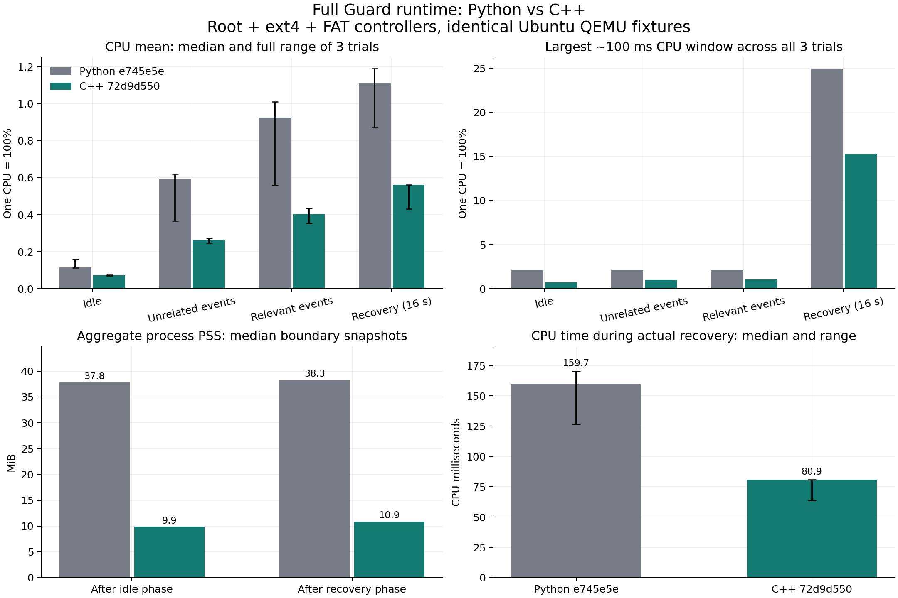

# C++ 完整恢复运行时的 QEMU 验收与比较

本文件对应 `lab/cpp_guard_probe.py` 和 `lab/cpp_transaction_probe.py`。比较对象是完整恢复控制器；此前的 C++ 只读观察器数据不能替代这里的结果。

## 控制变量

- Python 对照固定为 Git 提交 `e745e5e` 的完整 `guard` 和 `ram-rescue-demo` 源码。不能只替换旧测试中的两三个模块，否则会把前一次优化与语言迁移混在一起。
- 两组使用同一份已验证的 Ubuntu 镜像、Linux 7 内核、只读基础盘与每次新建的可写覆盖层，同样的 USB 根盘、ext4 数据盘、FAT 数据盘和工作负载。
- C++ 组在 PID 1 启动前，把根盘服务的 `ExecStart`、`ExecStopPost` 改为原生 ELF。数据盘服务也通过 RAM 中的 systemd 配置调用同一个 ELF 的 `maintain` 入口。原生 `activate` 负责保护启动时的根盘准入。
- 两组的登记、挂载计划生成和测试观察使用同一份 Python 工具；这些进程不在 Guard 的 cgroup 内。C++ 组不允许 Python 恢复控制器同时运行。
- 测试读取实际 `/proc/PID/exe` 的 ELF 内容并核对构建 SHA-256，不仅查看命令行名称。启动和接管入口都指向同一份已复制到 RAM 的可执行文件。
- 实验仅打开新建的普通镜像文件，没有宿主机块设备透传、共享目录、网络或者宿主机服务安装。

## 验收层次

`--scenario mounts` 复用已有的 28 项挂载验收：三盘恢复、原进程与文件描述符存活、原挂载 ID、嵌套挂载、bind 子挂载、错误身份拒绝、只读策略保留，以及超时后禁止新挂载。文件内容逐项核对，关机后对 ext4 和 FAT 做离线只读文件系统检查。

`--scenario performance` 在同一 VM 中测量空闲、每秒约 100 个无关事件、每秒约 100 个相关事件、三盘同时断联恢复。恢复测量启动后，控制端在重连后静默等待 17 秒，不用串口状态轮询干扰 16 秒采样窗口。CPU 以一个核心为 100%，从根盘服务和数据盘父 slice 读取，不把父子组重复相加。采样名义间隔为 20 ms，所有百分比使用真实经过时间计算，同时报告约 100 ms 窗口；短窗口计账波动不丢弃。PSS/RSS 是阶段边界快照，不能表述成持续采样的峰值。

`--scenario soak --cycles 10` 检查连续恢复后的常驻内存、线程、文件描述符、映射数和原控制器身份。初次恢复的增长与后续增长分别记录，避免把第一次调用的缓存建立误报成泄漏。

`cpp_transaction_probe.py matrix` 复用原事务矩阵的故障计划：七个恢复阶段杀死所有者、无接管者、截止时间、候选设备再次替换以及 NBD 请求不完成。适配器仅替换入口和进程识别；实际生成的测试源码保存在实验目录并记录哈希。这个矩阵验证事务安全，不代替正向恢复的数据持久性验收，也不能穷举所有内核调度交错。

## 复现命令

```bash
python3 lab/cpp_guard_probe.py --implementation python --scenario mounts
python3 lab/cpp_guard_probe.py --implementation cpp --scenario mounts
python3 lab/cpp_guard_probe.py --implementation python --scenario performance
python3 lab/cpp_guard_probe.py --implementation cpp --scenario performance
python3 lab/cpp_guard_probe.py --implementation python --scenario soak --cycles 10
python3 lab/cpp_guard_probe.py --implementation cpp --scenario soak --cycles 10
python3 lab/cpp_transaction_probe.py matrix
```

所有 VM 必须串行运行。性能测量前冻结二进制和源码，停止其他实验与编译负载；报告同时保存输入镜像、有效运行代码和实际执行文件的哈希。失败报告完整保留，不计入通过结果。

## 当前证据

已完成 Python 对照的完整挂载验收：`lab/work/cpp-pm-1002-045525-35597/report.json`，28/28 项通过，两种文件系统离线检查返回 0，源镜像和被测源码均未变化。

Python 十轮连续恢复也通过 19/19 项检查：`lab/work/cpp-ps-1002-050125-56046/report.json`。三实例合计 PSS 为初始 37.863 MiB、首轮后 38.243 MiB、十轮后 38.491 MiB；该运行允许宿主机编译同时进行，其 CPU 均值不用于最终性能对照。

首个 C++ 完整 Ubuntu 挂载实验通过 28/28 项检查：`lab/work/cpp-cm-1002-050649-76408/report.json`。三个控制器的实际 ELF SHA-256 均为 `9588633b6eaf0c8b8ea7645e4f65ee40f089e116ad031c800a3c9df2f76ad63b`，C++ 负责启动准入和恢复，两种文件系统离线检查返回 0。随后审阅修补会产生新二进制，最终结论必须对应最终二进制的再次验收。

事务框架初次试运行因覆盖层未保留 `root-init.sh` 的执行权限，11 个计划都在 `switch_root` 阶段终止，尚未进入恢复控制器测试；失败报告保留在 `20261002-050917-transaction-summary-95631.json` 中。框架已补回执行权限，这些失败不计入任何通过数量。

最终运行时 ELF 的 SHA-256 为 `72d9d550079b4f73e1954e13f99fa614826758c623eec1d3026aa22bc891b21f`。这一版本的验收如下：

| 实验 | 通过检查 | 原始报告 |
| --- | ---: | --- |
| 完整 Ubuntu 挂载、子挂载、身份拒绝及超时 | 28/28 | `lab/work/cpp-cm-1002-051450-98080/report.json` |
| 根盘与两块数据盘同时断联，连续十轮 | 19/19 | `lab/work/cpp-cs-1002-051548-116745/report.json` |
| 十一个事务故障计划 | 116/116 | `lab/work/20261002-051355-transaction-summary-96988.json` |
| 完整 Ubuntu 中提交后杀死所有者，systemd 接管 | 11/11 | `lab/work/20261002-051727-tx-kill-3-135727/report.json` |
| 正式打包、当前管理器和原始服务模板集成 | 32/32 | `lab/work/cpp-int-1002-092415-137566/report.json` |

事务矩阵覆盖七个阶段的所有者死亡，以及无管理者、截止时间、候选实例替换和无限期挂起的下层 NBD 请求。挂起实验在显式释放请求前保持 owner fence，截止时间后不再提交新映射或宣布恢复；测试期间 RAM 控制通道仍可用。完整 Ubuntu 的独立实验验证了实际 systemd `ExecStopPost` 接管，不仅是最小镜像中的 shell 接管。

十轮结束后，三个 C++ 控制器的 PSS 合计 **10.656 MiB**，Python 对照为 **38.491 MiB**，相差约 **72.3%**。C++ 初始、首轮后和十轮后的 PSS 分别为 9.572、10.479、10.656 MiB；最后五轮范围 0.106 MiB，RSS 范围 0.020 MiB，文件描述符与线程数均未持续增长。cgroup 内存记账的最终值分别是 C++ 7.094 MiB、Python 45.445 MiB；共享库页面的归属与 PSS 不同，这两个口径不能互相替代，也不包含整个 RAM 救援工具目录的大小。

正式包集成使用当前管理器、原始服务模板和 `exec` 启动脚本，没有测试专用的启动命令覆盖。三实例的实际 ELF、启动与终止后的包清单都通过核对。需要区分一个代价：手动救援工具仍保留 Python，因此加入 C++ 的 `libstdc++`、`libgcc_s` 和 ELF 后，RAM 工具镜像中的普通文件总量增加 **3,486,698 字节，约 3.33 MiB**。这是文件内容体积，不是新增进程 PSS，也不能直接与 PSS 相加；本轮收益主要来自常驻恢复控制器。

206 项最终原生功能断言、十轮内存检查点、执行文件证据和失败实验排除记录见[公开精简验收数据](../../lab/results/2026-10-02-cpp-validation.json)。

## 三轮完整运行时资源对照

六次新 VM 按 Python、C++、C++、Python、Python、C++ 顺序串行执行；每次 23/23 项验收通过。测量期间停止其他 VM 和编译负载。下面的均值取三次结果的中位数，方括号是全部三次结果范围，不是置信区间。每个逻辑 CPU 为 100%，数值是根盘、ext4、FAT 三个控制器及其子进程的合计。

| 阶段 | Python CPU 均值 % [范围] | C++ CPU 均值 % [范围] | 中位数下降 |
| --- | ---: | ---: | ---: |
| 空闲 | 0.1161 [0.1128, 0.1605] | 0.0712 [0.0690, 0.0754] | 38.6% |
| 无关事件约 100/s | 0.5943 [0.3670, 0.6199] | 0.2625 [0.2478, 0.2721] | 55.8% |
| 相关事件约 100/s | 0.9259 [0.5587, 1.0101] | 0.4024 [0.3528, 0.4329] | 56.5% |
| 断联恢复的完整 16 秒窗口 | 1.1100 [0.8745, 1.1912] | 0.5623 [0.4315, 0.5624] | 49.3% |

短窗口峰值使用三次试验中的最大值，保留所有波动；20 ms 和约 100 ms 是采样窗口，不是处理器的逐指令瞬时峰值。CPU 配额是带宽约束，不能据此承诺任意短窗口都不会超过某个百分比。

| 阶段 | Python 最大 20 ms / 100 ms CPU % | C++ 最大 20 ms / 100 ms CPU % |
| --- | ---: | ---: |
| 空闲 | 10.932 / 2.193 | 2.340 / 0.736 |
| 无关事件约 100/s | 5.535 / 2.159 | 3.522 / 0.995 |
| 相关事件约 100/s | 7.303 / 2.161 | 4.418 / 1.059 |
| 断联恢复的完整 16 秒窗口 | 46.546 / 24.995 | 27.365 / 15.276 |

| 内存口径 | Python | C++ |
| --- | ---: | ---: |
| 空闲结束 PSS，MiB，中位数 [范围] | 37.819 [37.794, 37.919] | 9.894 [9.702, 9.921] |
| 恢复窗口结束 PSS，MiB，中位数 [范围] | 38.300 [38.245, 38.393] | 10.875 [10.565, 10.896] |
| 空闲 cgroup 采样峰值，MiB，三次最大值 | 44.812 | 5.895 |
| 恢复 cgroup 采样峰值，MiB，三次最大值 | 47.336 | 8.824 |

为避免完整 16 秒窗口稀释急救期间的 CPU 占用，另外按照三个控制器最早 `waiting` 到最晚 `ready` 的日志划定实际恢复区间。计账使用覆盖该区间的相邻采样点，因此会略宽于日志边界。

| 实际恢复区间 | Python，中位数 [范围] | C++，中位数 [范围] |
| --- | ---: | ---: |
| 累计 CPU 时间，ms | 159.710 [126.356, 170.522] | 80.920 [63.615, 80.986] |
| CPU 均值，% | 4.840 [3.876, 5.136] | 2.482 [1.951, 2.484] |
| 恢复区间墙钟时间，s | 3.284 [3.246, 3.308] | 3.244 [3.238, 3.246] |

实际恢复累计 CPU 时间的中位数减少约 49.3%，端到端恢复仍约 3.2 秒。这里主要减少了控制器工作量，不能把这个结果解释为 USB 重连过程缩短一半。三个虚拟设备按顺序确认移除和重新添加，QMP 主机接收时间记录的各盘离线间隔为约 0.462–0.524 秒；显式等待 0.2 秒并不等于整个设备离线窗口仅 0.2 秒。

| 工作负载最大一次 I/O 停顿，s | Python，中位数 [范围] | C++，中位数 [范围] |
| --- | ---: | ---: |
| root | 2.839 [2.123, 2.985] | 2.233 [1.620, 2.796] |
| rr-data-vm-ext4 | 2.842 [2.227, 2.988] | 2.318 [2.240, 2.797] |
| rr-data-vm-vfat | 3.127 [3.061, 3.143] | 3.058 [3.040, 3.068] |

六次实验的持久化内容校验、原进程和挂载保留、映射恢复以及 ext4/FAT 离线检查均通过。三个试验样本支持本机 QEMU 条件下的比较，不构成所有硬件和负载下的性能保证。

[完整资源对照数据](../../lab/results/2026-10-02-cpp-performance.json)保留每次试验、每组 cgroup、内存快照、采样间隔、20 ms/100 ms 极值对应的原始计数窗口、二进制哈希和原始报告 SHA-256。

`lab/cpp_report.py` 可以从六份原始报告重新生成汇总和图。它复用公共报告校验器，并拒绝混合不同预算、基础镜像、Python 基线或原生二进制；只生成 JSON 不需要绘图库，`--plot` 需要 Matplotlib 和 NumPy。本轮可复现为：

```bash
python3 lab/cpp_report.py lab/work/cpp-[pc]p-1002-*/report.json \
  --output lab/results/2026-10-02-cpp-performance.json \
  --plot lab/results/2026-10-02-cpp-comparison.png
```

新一轮实验应传入该轮六份报告的实际路径，不能混入失败报告或把重复报告当作独立样本。迁移职责与部署边界见[迁移总报告](CPP-MIGRATION.md)。


